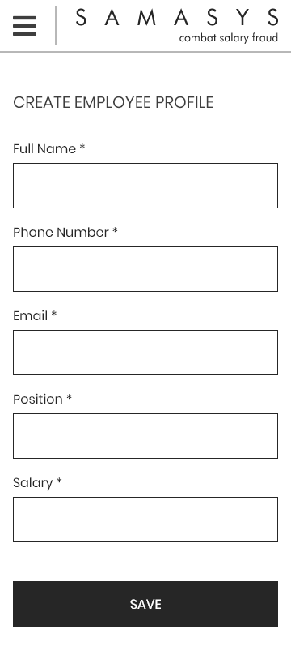
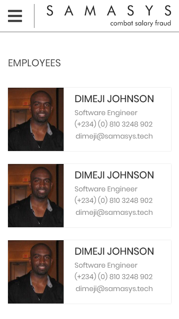
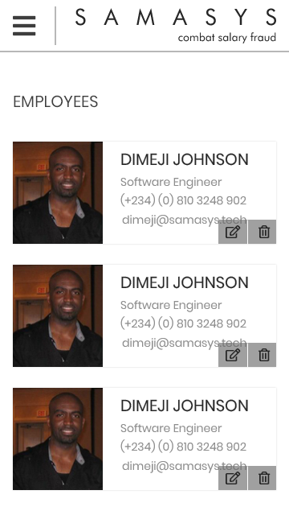
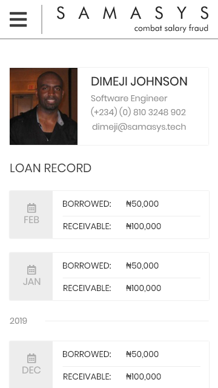

# Mobile Engineer Test

This test is meant to be submitted within 48 hours of receipt. We expect that you implement all tasks in the same project using Flutter. 

You will be judged on a scale of 100 for completion, correctness, clean code and documentation.

Tasks 1 & 2 are compulsory. Implementing task 3 is not a requirement. If completed, you will be awarded bonus points. We will also award bonus points for any extra justifiable considerations/improvements added to the application.

Your final score determines whether we will proceed to the next round of the interview.

After completion, please send us a link to your app's implementation privately hosted on GitHub. Please add the following GitHub account as a maintainer: @simone-dexter 

We also expect that the project on GitHub has the app's APK file.

## Tasks Background

We are developing an employee loan management portal at Samasys. The goal is to ensure that for any given month, each staff is able to track how much loan they have received as well as how much more they can receive. The portal also has an admin panel that allows the loan managers to view, create, update, delete records about the employees in the organisation.

For the tasks below, we assume that the end user is already logged in and has the required permissions to view the screens or carry out the operations below. In our case, the end user is the admin.

Please note that no API calls should be made. It is completely fine to store the data on the mobile device.

## Task 1

Our designer has sent us the designs of some of the pages we would have to implement. The first screen can be seen below:

On this screen the user is able to do the following:

- Create the employee profile
- Get **timely** feedback on wrong inputs
- Move the user to the employees listing page after the creation is successful

## Task 2

The second screen below shows a list of all the employees added on the platform. For now, pagination is not a priority but a nice-to-have.

Hovering on each of the employee listed above, gives the following screen below:

The user can do the following on this page:

- Delete the employee
- Clicking the edit button shows an error with a message indicating that the feature is not available at the moment.

## Task 3 (Bonus)

As a bonus task, we want to be able to see the full details of the employee when we click on each of the employee's name or image in the EmployeesPage above. This should take us to the page below:

On this page, the user is only able to view the data. Please feel free to use mock data to implement the screen.
